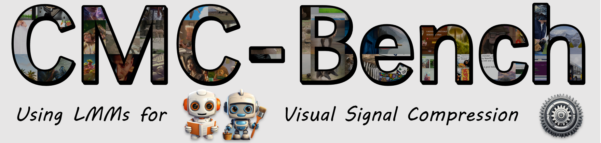
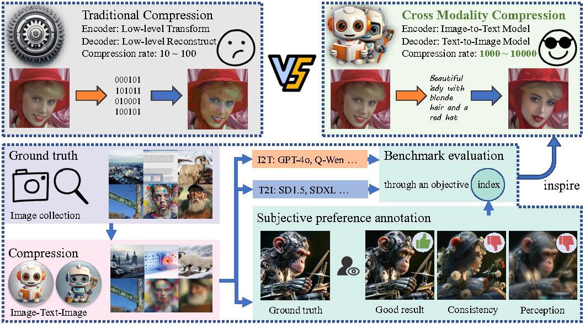
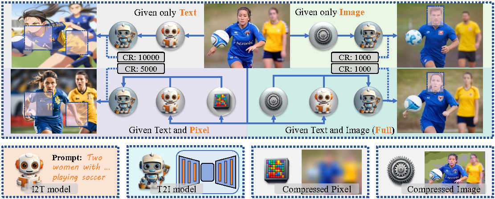
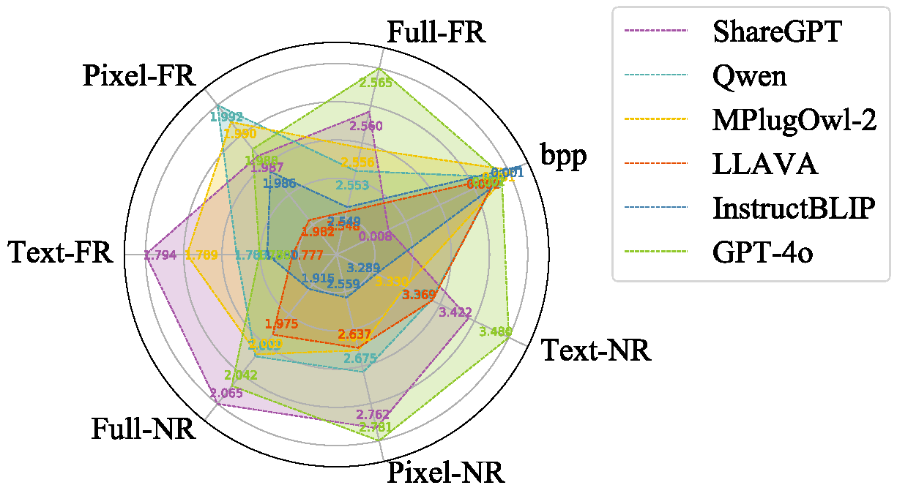
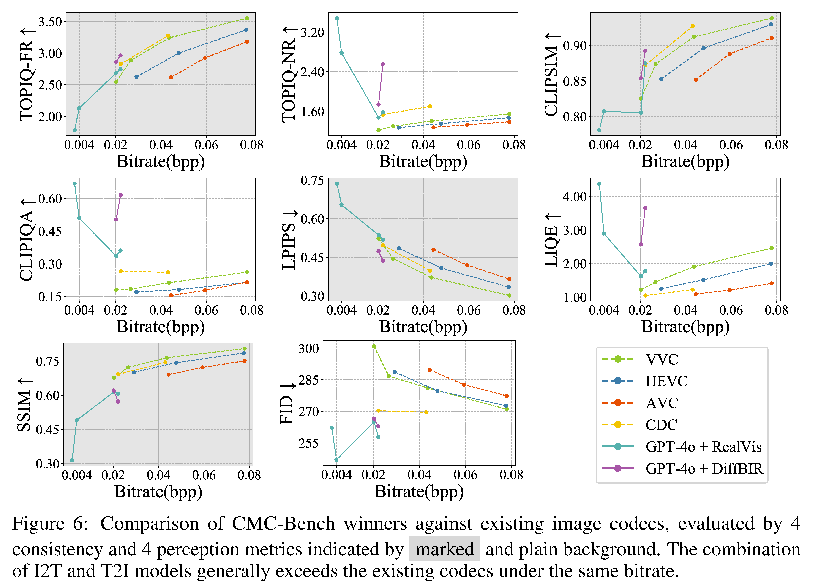

<div align="center">
    
    
 <div>
  <a href="https://github.com/lcysyzxdxc/"></a>
  <a href="https://github.com/Q-Future/CMC-Bench"></a>
  <a href="https://arxiv.org/pdf/2400.00000"></a>
  <a href="https://huggingface.co/datasets/lcysyzxdxc/CMC-Bench"></a>
 </div>

 <div style="width: 100%; text-align: center; margin:auto;">
      
 </div>

 <h1>CMC-Bench: Towards a New Paradigm of Visual Signal Compression</h1>

 _Using large Multimodal Models for Cross Modality Compression_

 <div>
      <a href="https://github.com/lcysyzxdxc" target="_blank">Chunyi Li</a><sup>1</sup>,
      <a href="https://multimedia.sjtu.edu.cn/index.php?m=home&c=View&a=index&aid=141" target="_blank">Xiele Wu</a><sup>1</sup>,
      <a href="https://teowu.github.io/" target="_blank">Haoning Wu</a><sup>2</sup>,
      <a href="https://medialab.sjtu.edu.cn/author/donghui-feng/" target="_blank">Donghui </a><sup>1</sup>,
      <a href="https://zzc-1998.github.io/" target="_blank">Zicheng Zhang</a><sup>1</sup>,
 </div>

 <div>
      <a href="https://guolusjtu.github.io/guoluhomepage/" target="_blank">Guo Lu</a><sup>1</sup>,
      <a href="https://minxiongkuo.github.io/" target="_blank">Xiongkuo Min</a><sup>1</sup>,
      <a href="https://jhc.sjtu.edu.cn/~xiaohongliu/" target="_blank">Xiaohong Liu</a><sup>1</sup><sup>*</sup>,
      <a href="https://ee.sjtu.edu.cn/en/FacultyDetail.aspx?id=24&infoid=153&flag=153" target="_blank">Guangtao Zhai</a><sup>1</sup><sup>*</sup>,
      <a href="https://personal.ntu.edu.sg/wslin/Home.html" target="_blank">Weisi Lin</a><sup>2</sup>
 </div>
 <div>
  <sup>1</sup>Shanghai Jiaotong University,  <sup>2</sup>Nanyang Technological University
 </div> 
 <div>
  <sup>*</sup>Corresponding author. 
 </div>
 <a href="https://github.com/Q-Future/CMC-Bench/blob/main/CMC_Bench.pdf"><strong>Paper</strong></a> |
 <a href="https://github.com/Q-Future/CMC-Bench"><strong>Project Page</strong></a> |
 <a href="https://huggingface.co/datasets/lcysyzxdxc/CMC-Bench"><strong>Data</strong></a> 
 <div style="width: 100%; text-align: center; margin:auto;">
      
 </div>
</div>

<div align="left">

**Why use LMMs for compression?** Large Multimodal Models (LMMs) support the conversion between multiple modalities, where text consumes much less space than image modalities. By cascading Image-to-Text (I2T) and Text-to-Image (T2I) models, images can be compressed and reconstructed from semantic information. This Cross-Modality Compression (CMC) paradigm operates at the semantic level, which outperforms traditional codecs at the pixel level. It enables easy attainment of 1,000 times compression, and even 10,000 times in extreme cases.

However, at such low bitrates, CMC presents two significant issues that cannot be overlooked. CMC-Bench is designed to evaluate : **(1) Consistency** between the distorted and reference image, **(2) Perecption** quality of the distorted image only. Thus, CMC-Bench is designed to identify where LMMs can be further optimized toward the compression task, thereby promote the evolution of visual signal codec protocols.

## Release
- [2024/6/13] 🔥 [Github repo](https://github.com/Q-Future/CMC-Bench) for **CMC-Bench** is online. Follow the instruction to join the I2T or T2I model arena!!
- [2024/6/11] 🔥 We release the **CMC-Bench** data and meta information at [Huggingface](https://huggingface.co/datasets/lcysyzxdxc/CMC-Bench).
- [To Do] [ ] Update the subjective label for quality assessment task.
- [To Do] [ ] Update all interval image and text data for compression.

## CMC-Bench Construction
To provide a comprehensive and high-quality resource for various applications on the Internet, we carefully curated 1,000 images without compression distortion as the ground truth of CMC-Bench. Including 400 NSIs, 300 SCIs, and 300 AIGIs. The data selection and annoattion detail are attached in out paper.

We employ 6 I2T and 12 T2I models across four working modes. **(1) Text** mode with only T2I and I2T model; **(2) Pixel** mode with several pixels to guide T2I model; **(3) Image** mode with a compressed image as I2T guidance but without I2T model; **(4) Full** mode with all necessary information but most expenses. A I2T+T2I group will be evaluated in 4*2=8 dimensions.

<div style="width: 100%; text-align: center; margin:center;">
      
</div>

## Leaderboard of CMC-Bench
Radar maps are shown as a quick glance. Among I2Ts, GPT-4o shows the best perfoemance. Among T2Is, DiffBIR ranks best in terms of **Image** and **Full** but unsupportive at other two modes, while RealVis is the most full-edged model for **Consistency** and PG25 owns the most satisfying **Perecption**.
<div style="width: 100%; text-align: center; margin:center;">
  
</div>

The leaderboard for I2T and T2I models are shown below. The I2T models are combined with RealVis as T2I, while T2I models are combined with GPT-4o as I2T. For detailed performance on differnet content types, please check our paper.


| **I2T** | Full-FR↑ | Full-NR↑ | Pixel-FR↑ | Pixel-NR↑ | Text-FR↑ | Text-NR↑ | Overall↑ |
| - | - | - | - | - | - | - | - |
| GPT-4o | 2.5646 | 2.0415 | 1.9878 | 2.7815 | 1.7805 | 3.4802 | 2.4394 |
| ShareGPT | 2.5597 | 2.065 | 1.9872 | 2.7618 | 1.794 | 3.4221 | 2.4316 |
| Qwen | 2.553 | 2.0031 | 1.9917 | 2.6748 | 1.7832 | 3.3679 | 2.3956 |
| MPlugOwl-2 | 2.5556 | 2.0003 | 1.9902 | 2.6413 | 1.7891 | 3.3299 | 2.3844 |
| LLAVA | 2.5484 | 1.9747 | 1.9815 | 2.6373 | 1.7766 | 3.3695 | 2.3813 |
| InstructBLIP | 2.5489 | 1.9153 | 1.9858 | 2.5593 | 1.7796 | 3.2888 | 2.3463 |


| **T2I** | Full-FR↑ | Full-NR↑ | Image-FR↑ | Image-NR↑ | Pixel-FR↑ | Pixel-NR↑ | Text-FR↑ | Text-NR↑ | Overall↑ |
| - | - | - | - | - | - | - | - | - | - | 
| DiffBIR | 2.9194 | 2.5803 | 2.863 | 1.7342 | - | - | - | - | 2.6466 |
| PASD | 2.727 | 2.2256 | 2.6378 | 2.0101 | - | - | - | - | 2.4942 |
| PG25 | 2.0716 | 2.9194 | 1.9612 | 2.9935 | 1.7418 | 3.626 | 1.7382 | 3.7299 | 2.3579 |
| RealVis | 2.5646 | 2.0415 | 2.5033 | 1.8098 | 1.9878 | 2.7815 | 1.7805 | 3.4802 | 2.3155 |
| PG20 | 2.3603 | 2.3695 | 2.2476 | 2.2071 | 1.8883 | 2.6875 | 1.718 | 3.7438 | 2.2864 |
| SSD-1B | 2.4939 | 2.0803 | 2.4147 | 1.9308 | 1.9611 | 2.4828 | 1.7753 | 3.4796 | 2.2720 |
| StableSR | 2.6232 | 1.4368 | 2.6088 | 1.4293 | - | - | - | - | 2.2217 |
| Dreamlike | 2.5071 | 1.7892 | 2.4226 | 1.5131 | 1.9545 | 2.3038 | 1.709 | 3.1588 | 2.1626 |
| Animate | 2.2985 | 1.8469 | 2.2522 | 1.6148 | 1.8246 | 2.4324 | 1.6983 | 3.4979 | 2.1283 |
| SDXL | 2.4184 | 1.6837 | 2.3482 | 1.5586 | 1.9103 | 1.9724 | 1.7471 | 3.4225 | 2.1238 |
| SD15 | 2.4895 | 1.7733 | 2.4163 | 1.5574 | 1.9422 | 2.1444 | 1.6832 | 2.5318 | 2.0891 |
| InstructPix | 2.1519 | 1.7191 | 2.3457 | 1.2219 | - | - | - | - | 1.9894 |


## Compare against traditional codecs

CMC paradigms demonstrate an advance in terms of most indicators. The lead in Perception is particularly notable, as it surpasses traditional codecs at extremely low bitrates. However, the advantage in consistency is relatively smaller, achieving a reduction of around 30\% in bitrate compared to traditional methods at 0.02 bpp. The DiffBIR decoder generally shows better performance, while RealVis fits A wider range of bitrates.

In summary, we believe that CMC holds a certain advantage over traditional encoding. However, for implementing LMMs into the next generation of visual signal codecs, further optimization is still required for LMM developers.

<div style="width: 100%; text-align: center; margin: center;">
      
</div>

## Evaluate your model on CMC-Bench

### Step 0: Preparation

First download the images from our Hugging website, including:

[Ground Truth](https://huggingface.co/datasets/lcysyzxdxc/CMC-Bench/blob/main/ground-truth.zip). Decompress all file into `GT` folder in this project.

[Pixel Reference](https://huggingface.co/datasets/lcysyzxdxc/CMC-Bench/blob/main/reference-pix.zip). Decompress all file into `Ref/pixel` folder in this project.

[Compressed Image Reference](https://huggingface.co/datasets/lcysyzxdxc/CMC-Bench/blob/main/reference-image.zip). Decompress all file into `Ref/image` folder in this project.

Then download the Consistency an Perception evaluation model weight from:

[Consistency](https://huggingface.co/datasets/lcysyzxdxc/CMC-Bench/blob/main/topiq-fr.pth). Put it into `Weight` folder in this project.

[Perception](https://huggingface.co/datasets/lcysyzxdxc/CMC-Bench/blob/main/topiq-nr.pth). Put it into `Weight` folder in this project.

After process above, please ensure your folder look like:

```
CMC-Bench
│
├── GT
│   ├── AIGI_DALLE3_000.png, AIGI_DALLE3_001.png ...
│   
├── Ref
│   ├── pixel
│       └── AIGI_DALLE3_000.png, AIGI_DALLE3_001.png ...
│   └── image
│       └── AIGI_DALLE3_000.png, AIGI_DALLE3_001.png ...
│
└── Weight
    ├── topiq-fr.pth, topiq-nr.pth
```

### Step 1: I2T model encoding

Use I2T model to transform ground truth image into text.

```
python script-i2t.py --model_name [your_i2t_name] --model_dir [your_i2t_dictionary]
```

A csv file including all text input will be generated in your `Text` folder according to `your_i2t_name`. The default script use Qwen for I2T. If you only want to test T2I model, please skip this step and directly use `Text/gpt4v.csv`.

### Step 2: T2I model decoding

Use T2I model to reconstruct text back into image.

```
python script-t2i.py --mode full --input_path [csv_in_step_1] --model_name [your_t2i_name] --model_dir [your_t2i_dictionary]
python script-t2i.py --mode image --input_path [csv_in_step_1] --model_name [your_t2i_name] --model_dir [your_t2i_dictionary]
python script-t2i.py --mode pixel --input_path [csv_in_step_1] --model_name [your_t2i_name] --model_dir [your_t2i_dictionary]
python script-t2i.py --mode text --input_path [csv_in_step_1] --model_name [your_t2i_name] --model_dir [your_t2i_dictionary]
```

All decompressed image will be generated in your `Result` folder according to `your_t2i_name`. Four subfolder corresponds to four working mode. The default script use RalVis for T2I. If you only want to test T2I model, please empty the `--input_path `; If you only want to test I2T model please empty the ` --model_name` and ` --model_dir`.

### Step 3: Evaluation

Use fine-tuned quality model to mesure the performance. Check the model name in your `Result` folder, all modes in it will be evaluated. The script can still be evaluated with incomplete modes, but we recommend using all four modes at once.

```
python script-evaluate.py --target [t2i_name_in_step_2]
```

After finishing validation, you can submit the results via [e-mail](lcysyzxdxc@sjtu.edu.cn) to get your LMM results on CMC-Bench ! (Noted a valid submission should support at least two among four modes.)

</div>

## Contact

Please contact any of the first authors of this paper for queries.

- Chunyi Li, `lcysyzxdxc@sjtu.edu.cn`, @lcysyzxdxc

## Citation

If you find our work interesting, please feel free to cite our paper:

```bibtex

```
